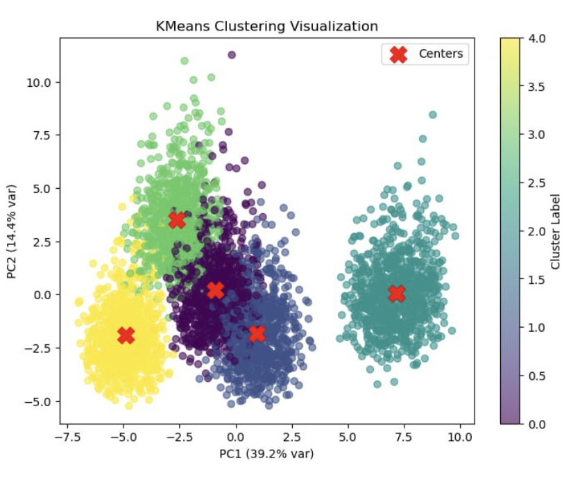
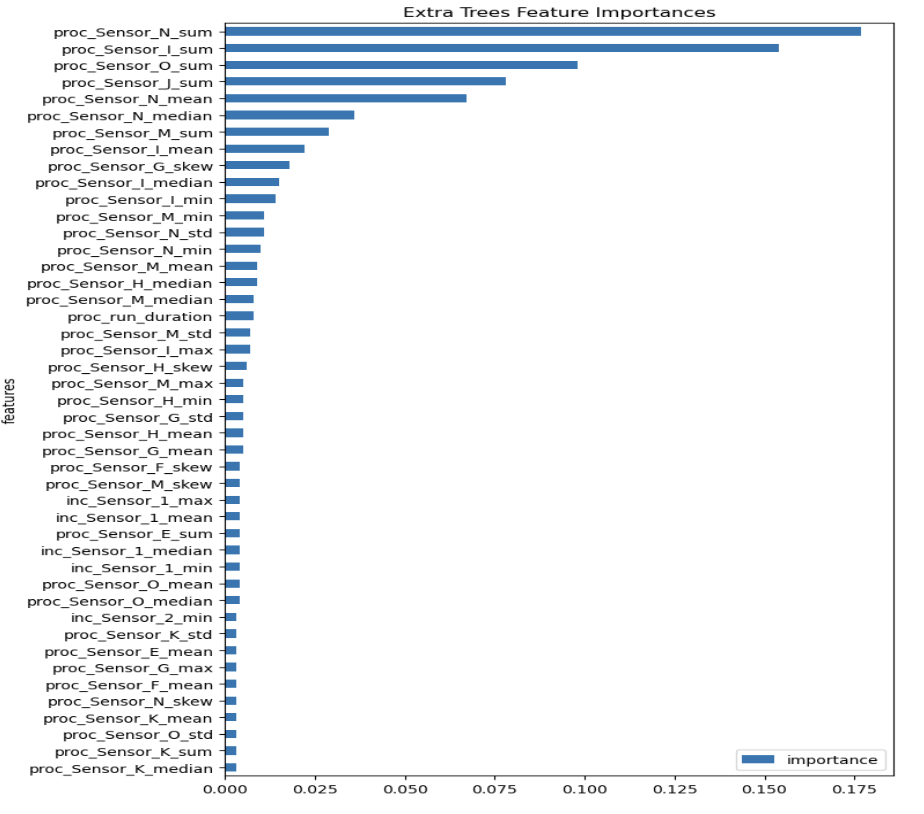

# Micron AI Challenge 2025

## Challenge Overview

In semiconductor manufacturing, complex process steps and toolings are involved. This challenge focuses on one of the critical process steps where various tools are used and multiple sensors capture signals during the process. The goal is to predict wafer-level measurements that record output values at different locations (x,y coordinates) of the product.

## General approach and methodology

### Initial data transformation

1. The metrology data is first pivot-widened, where the incoming and run data were enriched with aggregated statistics over time for each run, along with the run duration (mean, std, min, max, median, skew, sum). This means that the metrology data is represented in wide table format for model training, where each row represents a run and columns represent the 49 distinct measurements.
2. We also extract static features like consumable life which are joined with the aggregated time series features, creating a more comprehensive set of features. 
3. Afterwards, the 3 datasets (incoming + run + metrology) are merged/joined on the basis of RunId.

### Modelling pipeline decisions

1. To further enrich the data, we incorporated K means clustering to provide and create unsupervised learning features of cluster label and distance. This distances act as “similarity features” (samples with similar distance profiles likely behave similarly)

2. To ensure the model does not overfit to noise, we implement Extra Trees feature selection techniques to handle non-linear sensor interactions and produces interpretable importances with low variance.

3. Lastly, to ensure estimates are robust, we incorporated an Ensemble Design consisting of an XGBoost regressor and a LightGBM regressor (n_estimators = 500, early-stopping 20).

### Justification and insights from KMeans and Extra Trees feature selection

1. Extra trees are trained on the full feature set to predict the metrology targets. The top 45 features by importance are selected afterwards. Extra Trees is particularly good at feature selection because: It uses random thresholds for splits (not just best thresholds) + reduces overfitting compared to regular Random Forests.
2. Feature importance analysis identified Sensor N and I to be influential and confirm that process-sensor sum dominate predictive power; the top feature reaches an importance of ≈ 0.175, followed by a long-tail power-law decline.
K Means indeed show clear clustering of data points, which suggest that our K Means approach was going in the right direction.

*Figure 1: KMeans clustering showing clear separation of centroids, validating our clustering approach.*

*Figure 2: Extra Trees feature importance analysis showing the relative importance of different features in predicting the target variable.*

### Model pipeline

> The training and inference pipeline consists of the following approaches:

- Individual training of these 2 tree based machine learning models
    - Extreme gradient boosting with full hyperparameter tuning search
Light gradient boosting machine (ability to create more complex/deeper trees)

- Key design decisions to consider bias variance trade offs:
    - Early stopping to prevent overfitting
    - Ensemble with a 40/60 weighting for XGB and LightGBM respectively for accurate and robust predictions

## Final scores
- The final test score of our pipeline is 0.03237 RMSE, a 4-fold improvement over the Extra Trees baseline.